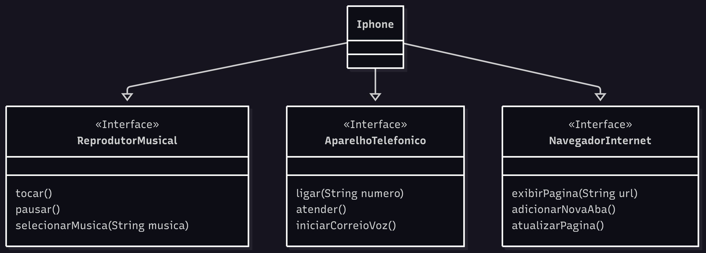

# 📱 Desafio POO - Modelagem e Diagramação de um Componente iPhone

## 🧩 Enunciado

### Modelagem e Diagramação de um Componente iPhone

Neste desafio, você será responsável por modelar e diagramar a representação UML do componente **iPhone**, abrangendo suas funcionalidades como:

- Reprodutor Musical
- Aparelho Telefônico
- Navegador na Internet

### 🎥 Contexto

Com base no vídeo de lançamento do iPhone de 2007, você deve elaborar a diagramação das classes e interfaces utilizando uma ferramenta UML de sua preferência.  
Em seguida, implemente as classes e interfaces no formato de arquivos `.java`.

**Minutos relevantes:** 00:15 até 00:55

---

### ✅ Funcionalidades a Modelar

#### 🎵 Reprodutor Musical

- `tocar()`
- `pausar()`
- `selecionarMusica(String musica)`

#### 📞 Aparelho Telefônico

- `ligar(String numero)`
- `atender()`
- `iniciarCorreioVoz()`

#### 🌐 Navegador na Internet

- `exibirPagina(String url)`
- `adicionarNovaAba()`
- `atualizarPagina()`

---

## 📌 Objetivo

- Criar um **diagrama UML** que represente as funcionalidades descritas acima.
- Implementar as **interfaces e a classe `Iphone`** em Java. *(Opcional, mas recomendado)*

---

## 📷 Diagrama UML

<!-- Substitua o link abaixo pela imagem do seu diagrama UML -->

---
